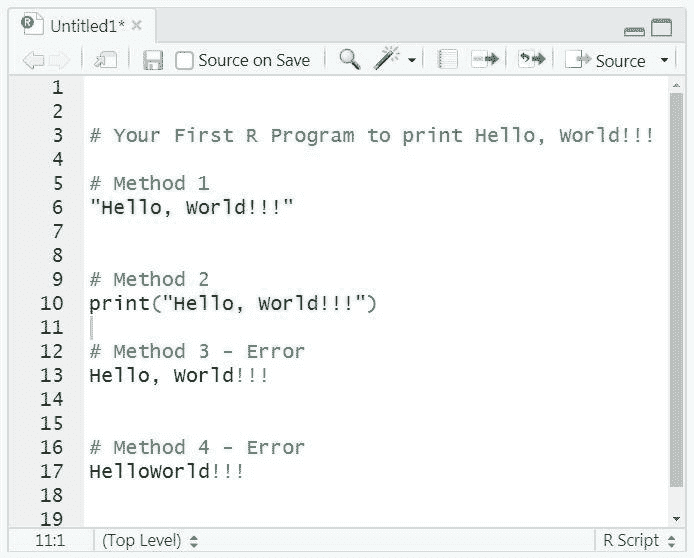
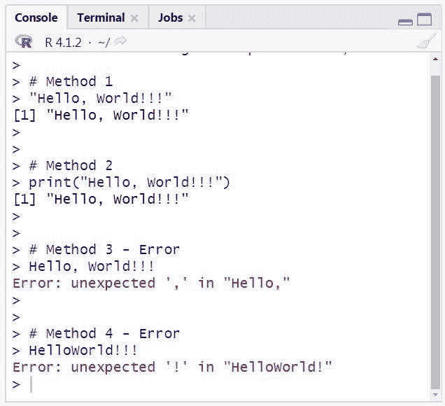
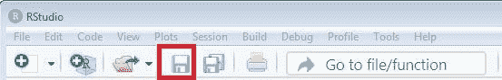
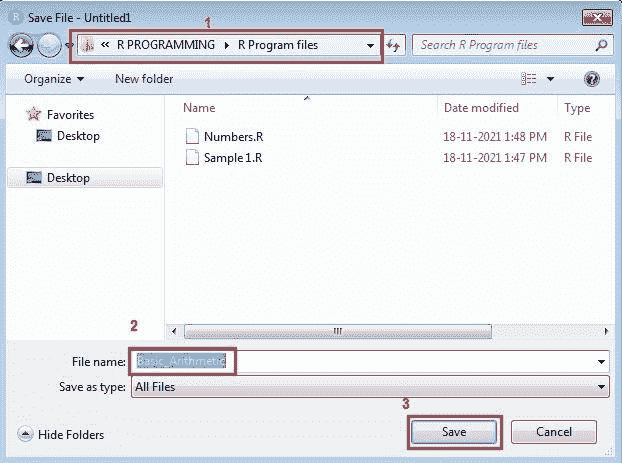
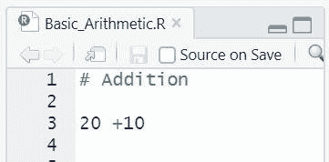

# R 编程的语法和基础

> 原文：<https://learnetutorials.com/r-programming/basics-for-beginners>

本教程旨在对 R 程序以及如何在 R Studio 中编写第一个 R 程序给出基本的见解。此外，你将学习如何将你的 R 程序保存在文件中，以及运行 R 程序的各种方法等等。所以不浪费时间，让我们开始吧。

## 你在 R Studio 文本编辑器中的第一个 R 程序

如果你是一名程序员，肯定第一个映入你脑海的程序就是打印消息“你好，世界！！!"。为什么不从 Hello World 开始-可以参考 [R 程序打印 Hello World](https://learnetutorials.com/r-programming/programs/hello-world-program) 。

请参见下面的截图，其中显示了您可以显示消息的各种方式。



从我们之前的教程中，您现在知道了输出显示的确切位置。如果您不知道，请随时访问我们之前的教程- [R STUDIO 安装 WINDOWS](../r-programming/r-studio-installation) 。上述程序的输出将显示为:



## r 评论

R 编程语言中的注释是在散列( **#** )之后编写的文本，以使代码更易读。在上面的程序中，我们从第三行开始我们的代码，注释从第一眼就告诉用户这是一个“你好世界程序”。在哈希( **#** )之后写的任何东西都不会被执行，因为编译器只会忽略文本。

评论区实际上不是为前端用户准备的，而是为程序员准备的。这有助于他们跟踪程序的每个部分，而不会干扰编程结构。

注释的常规语法中的一点变化将帮助用户轻松地浏览代码。更改是在 **#** 和**# # # # #**之间删除注释，如下所示:

```r
 # Comment text  #### 

```

您可以在下面的示例中看到这种变化，这对于程序员编写冗长的代码来说确实是一种帮助。


当您将上述程序与第一个程序进行比较时，您可以看到以下内容:

*   **#** 和**# # # # #**中的注释列在底部栏中。
*   光标将根据选择移动，您可以观察光标的位置。在我们的示例中，光标位于方法 3-错误的位置。

**注**:因为注释不是编程语句，所以可以

与其他编程语言不同， **R 不支持多行注释**。然而，在某些情况下，你想一次评论一堆行。在 R 有可能吗？是的，只要按照说明去做；

*   选择要注释的整个部分
*   从菜单栏中选择**代码- >注释/取消注释**行或使用快捷键 **Ctrl +Shift+C** 。

## r 语法

r 语法非常简单，任何人都可以在几分之一秒内轻松理解它。让我看看

### 1.字符串语法

r 字符串由双引号(“...”)或单引号(“...”)中的边界文本或字符定义。)引号。r 区分大小写，因此“X”和“X”在 r 中有不同的含义。

```r
 # Method 1
"Hello, World!!!" 

```

输出将是:

```r
 > # Method 1
> "Hello, World!!!"
[1] "Hello, World!!!" 
```

如果我们遗漏了单引号或双引号，那么输出将是一条错误消息，如:

```r
> # Method 3 - Error
> Hello, World!!!
Error: unexpected ',' in "Hello,"

```

### 2.数字的语法

如图所示，用 R 定义数字非常简单明了。直接输入你想要的数字，它就会按原样输出。

```r
 # Defining Numbers in R
500
1000
1984 

```

输出将是:

```r
 > 500
[1] 500
> 1000
[1] 1000
> 1984
[1] 1984 
```

## 如何在 R Studio 中运行一个 R 程序？

r 是一种完全不同的语言，主要处理数据科学，因此在执行程序时很棘手。很明显，我们可以在 R 中运行小的和基本的程序，但事实是 R 使用一个巨大的数据集，你会在你即将到来的教程中看到。在这一部分中，您将看到运行按钮在 R studio 中的位置，以及如何以多种方式在 RStudio 中运行 R 程序。

要执行代码，R 在工具栏中有 3 个选项。

1.  快动按钮
2.  “重新运行”按钮，有助于重新运行前面的代码部分
3.  运行整个文档的源按钮。


### 1.运行单行

要运行一行代码(当前光标所在的位置)，您可以使用工具栏中的**运行**按钮，或者使用快捷方式: **Ctrl + Enter** (Windows 操作系统)。

### 2.运行多行

要运行多行代码，您需要首先选择所需的行，然后使用工具栏中的**运行**按钮或使用快捷方式: **Ctrl +Enter** (windows 操作系统)。

注意:在 RStudio 中，执行的代码将自动执行

如果你很好奇，想了解更多关于 R 程序的编辑和执行，请访问[如何在 RStudio](https://support.rstudio.com/hc/en-us/articles/200484448-Editing-and-Executing-Code) 中编辑和执行 R 代码。

## 如何保存 R 脚本？


观察以上程序可以看到，默认情况下，R 脚本被命名为**无标题 1。R** 。您可以保持名称不变，也可以通过以下方式将其更改为更有意义的名称:

1.  单击脚本编辑器面板上的保存图标进行保存。
2.  选择**文件- >保存**或快捷键 **Ctrl + S** 。

在这两种情况下，您将会看到一个窗口，您可以在其中浏览您想要保存程序文件的位置，并可以根据您的程序输入一个有意义的名称，然后单击保存按钮将代码保存为新名称。见下文:



现在可以看到屏幕编辑器顶部的文件选项卡中的 R 脚本名称变为**Basic _ algorithm。R** 。



到目前为止，您已经掌握了 RStudio 中用于运行 R 程序的最常见命令的知识。最后但同样重要的是，让我提醒你一个事实，R 是一种编程语言，用于处理统计分析和巨大的数据集，即使 R 可以处理小数据。所以在学习过程中千万不要低估 R 作为一种常用的编程语言。请始终记住，R 只需几个步骤就能在短时间内处理大型数据集。例如，见下面的例子:

下面的代码将为您提供如下所示的条形图:

```r
 x <- c("P", "Q", "R", "S")
y <- c(20, 40, 30, 50)

barplot(y, names.arg = x, col =c("blue","green","yellow","red")) 

```

输出将是:


在我们未来的教程中，您将掌握更多关于 R 编程的知识，并将进入更复杂的问题。因此，如果你很兴奋，继续我们即将到来的教程，扩展你的知识。

要了解更多关于 R 的例子，请访问我们的 [R 程序](https://learnetutorials.com/r-programming/programs)。