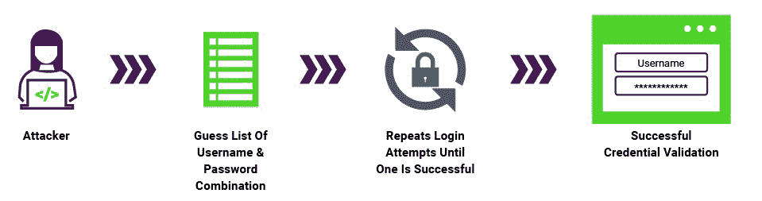
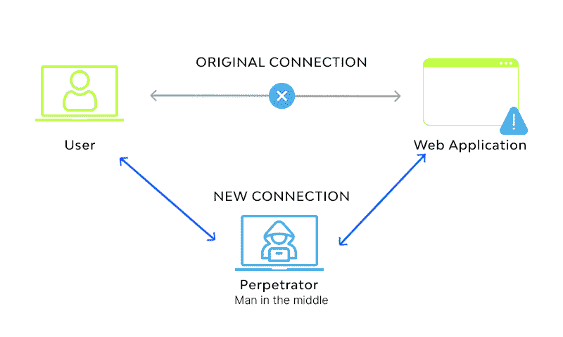

# 网络攻击的类型

> 原文：<https://learnetutorials.com/cyber-security/types-of-cyber-attacks>

我们知道我们生活在一个数字世界里，几乎所有的日常活动都依赖于互联网和电子设备，如电子购物、移动设备、社交媒体、网上银行等。这种依赖性会导致非法黑客和网络罪犯打开窃取您的信息和身份的途径。现在，这些非法活动已经发展成为一个可怕的犯罪世界。

网络攻击可以被定义为非法攻击或访问计算机或网络，并在计算机蠕虫或恶意软件的帮助下窃取其中的数据或试图破坏该系统或网络。这种导致信息或身份甚至金钱损失的攻击可以被称为网络犯罪，网络犯罪的幕后黑手被称为**网络罪犯**。

从广义上讲，网络攻击可以根据攻击的影响分为两种类型

1.  基于网络的攻击
2.  基于系统的攻击

## 基于网络的攻击

顾名思义，基于网络的攻击是针对网站和网络组件的攻击。它可以直接或间接地对任何网站或网络应用程序产生影响。一些基于网络的攻击包括

1.  DNS 欺骗
2.  会话劫持
3.  注射攻击
4.  网络钓鱼
5.  蛮力
6.  拒绝服务
    1.  基于卷的攻击
    2.  协议攻击
    3.  应用层攻击
7.  Url 解释
8.  字典攻击
9.  中间人攻击

### 1 域名系统欺骗

域名系统被称为域名服务器，它帮助用户的请求到达网站的正确 IP 地址。域名系统欺骗是一种黑客将数据添加到名称服务器缓存的方法，将用户请求转移到错误的 IP 地址或错误的系统。

这种攻击会将流量转移到错误的服务器或系统，并且可以在名称服务器缓存中停留很长时间而不会被捕获。

### 2 会话劫持

这是对用户会话的一种攻击，目的是获取该用户的所有数据。网站会制作存储用户一些重要信息的 cookie，窃取这些 cookie 会让黑客获得所有用户数据。

### 3 次注射攻击

这是对网站的一种不同类型的攻击，黑客会注入一些能够操纵网站数据库的代码，黑客可以从该网站数据库获取所有信息。

示例:SQL 注入、XML 注入等

### 4 悬崖

互联网是我们现在的日常伴侣，几乎我们所有人都在为了这样或那样的需要使用互联网，几乎一整天。当你在网上冲浪的时候，你有没有看到过类似弹出窗口的东西，显示你的电脑被锁住了，或者被感染了，或者发现了一些危险的威胁，就像这样？它叫做斯卡瓦雷。它还有一个按钮作为补救措施，比如下载一些软件或要求付款。如果你点击这样的下载按钮，一个名为 scareware 的恶意程序就会被下载并安装在你的电脑上，使你的电脑被锁定，直到支付赎金，甚至窃取你电脑上的数据。

### 5 网络钓鱼

网络钓鱼是一种网络攻击，旨在窃取用户的敏感信息，如登录信息、银行交易详细信息或信用卡详细信息。这通常是通过电子邮件完成的，黑客会发送一封看起来来自真实来源的电子邮件。它也被用来在受害者的电脑中安装恶意软件。

### 6 蛮力

我们已经听说需要创建一个强密码，包括数字、特殊字符等。那就是管理这种叫做暴力的攻击。在暴力攻击中，黑客尝试许多组合猜测，直到找到正确的凭证。这种方法也用于破解加密数据。

### 7 拒绝服务

拒绝服务或拒绝服务攻击是一种常见的攻击类型，网络罪犯试图通过向服务器发送大量垃圾请求(流量)来关闭服务器，直到服务器能够处理该请求。

一旦服务器耗尽，真正的用户也无法到达服务器，这将破坏网络。简单地说，这种攻击是拒绝从服务器向真正的用户提供服务。它可以是三种类型

7.1 批量攻击:黑客发送巨大的流量，使网站的带宽耗尽。
7.2 协议攻击:这种类型的 DOS 攻击会使服务器资源耗尽，因为它会在没有任何需要的情况下消耗原始服务器资源。
7.3 应用层攻击:其主要目的是让网络服务器

### 8 网址解释

每个服务器都有一些公众无法访问的页面。在网址解释中，黑客改变网址，让服务器将秘密页面传送给用户。

### 9 名中路进攻队员

顾名思义，黑客拦截一个连接，充当用户和服务器之间的中介。黑客能够读取和修改用户和服务器通信的所有消息。

### 10 个广告软件

互联网充满了广告，这是许多在网络空间运行的网站的主要收入来源。但是一些罪犯制造一些恶意软件，迫使用户显示广告，并将用户重定向到广告页面或产品页面。

## 基于系统的攻击

上述攻击基于网络和互联网。现在有另一种类型的攻击，其目标是系统及其资源。

1.  [病毒]病毒
2.  虫
3.  特洛伊木马
4.  后门
5.  蝇蛆病

## 1 病毒

顾名思义，它是一段计算机代码，能够在用户不知情的情况下在计算机系统中传播，并能够自我复制，它包含一个可执行的代码片段，能够破坏系统或从受感染的系统中窃取一些数据。世界上一些危险的病毒是

*   莫里斯蠕虫
*   尼姆达(电脑病毒名称)
*   ILOVEYOU
*   蓝宝石
*   Stuxnet
*   敲诈者
*   Conficker
*   Tinba

### 两个间谍

间谍软件是一些恶意程序代码，它们被安装在目标系统中，而用户不知道能够从该系统中窃取敏感信息并将该信息发送到远程服务器。通常，用户的浏览模式和兴趣被发送到服务器。
更危险的间谍软件包括键盘记录器，它可以访问我们在键盘上键入的密码，并将数据发送到服务器。通常，恶意软件会在安装我们从未知来源下载的免费软件时被安装。

### 3 蠕虫

蠕虫是一种病毒，旨在窃取敏感信息或破坏网络或系统。与病毒不同，蠕虫不需要任何人为活动就能在网络中从一个受感染的系统传播到另一个系统。蠕虫利用电子邮件或操作系统的漏洞在网络中复制和传播。它还会使用网络或系统的资源，使其对真实用户来说变慢或不可用。

### 4 特洛伊木马

特洛伊木马是一种古老的战争结构，它将文件夹隐藏在一匹巨大的木马中，这匹马有一个后门，它从敌人的领土内发动攻击。像特洛伊木马一样，它是一个代码片段，假装是来自真实来源的真实软件，但能够对主机系统进行意外更改。特洛伊木马将作为正常程序运行，但它会破坏主机系统中的数据，并使其容易受到攻击，例如为远程系统打开后门来控制该主机系统。
木马可使多台主机被一台主计算机控制，并形成此类僵尸计算机的网络。特洛伊木马没有蠕虫和病毒危险，因为它们不能复制或传播到网络中的另一个系统。

### 5 个后门

这是一种绕过身份验证过程的方法，通常由开发人员访问某些应用程序来完成。但是网络罪犯使用这种方法来破解许多付费软件，甚至是操作系统。